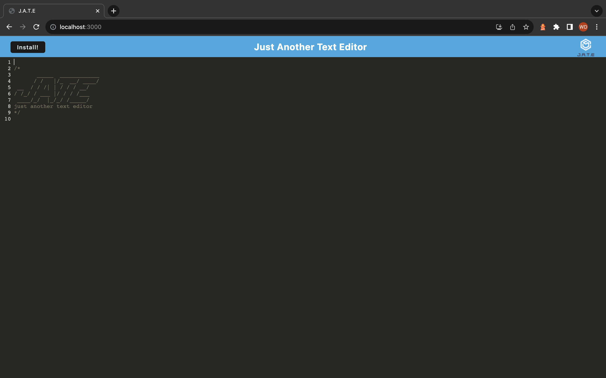

# J.A.T.E. (Text-Editor)

## Description

## Installation

## Usage

To use this application, click on the "Start Quiz" button. When the buttton is clicked, the questions and possible answers are displayed, and a 75-seconds timer starts. Select an answer to move to the next question.
The total score is displayed tt the end of the quiz. Enter your initials and click "Submit" to save your score.

The following image shows the web application's appearance and functionality:
Start Page:

Quiz Page:

Highscore Page:

## Credits

AskBCS Tutors  
Course Resources

## License

N/A

## Deployment

Here is the link to the web application:
[J.A.T.E](https://wdverse.github.io/Code-Quiz-Challenge/)
