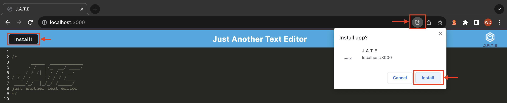
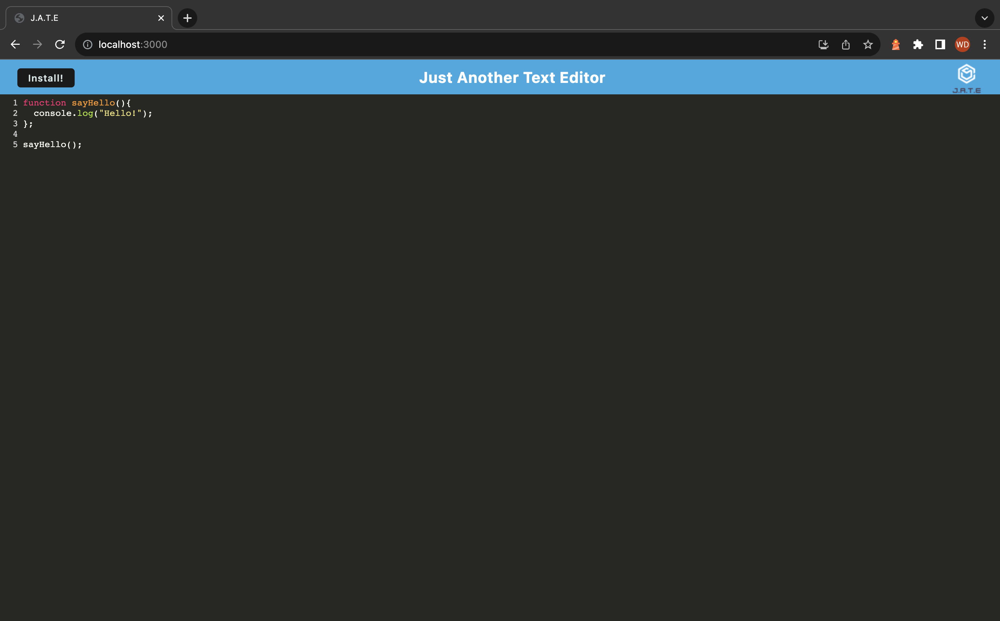

# J.A.T.E. (Text-Editor)

## Description

This text-editor is a single-page application that meets the PWA criteria. The application applies syntax highlighters to javascript code. It can be used on web browsers or installed to be used as a desktop application.

## Installation

To install open in a google chrome browser, click the "Install!" button or the install icon on the right side o the address bar. Click "Install" on the pop-up menu.    

The following image serves as a guide:  

## Usage

To use this application, enter your javascript code in the text-editor.

The following images shows the application's appearance and functionality:  

When app is opened:  

When JavaScript code is entered:  

## Credits

AskBCS Tutors  
Course Resources

## License

N/A

## Deployment

Here is the link to the web application:
[J.A.T.E](https://edityourtexthere-d4cbb3200683.herokuapp.com)
